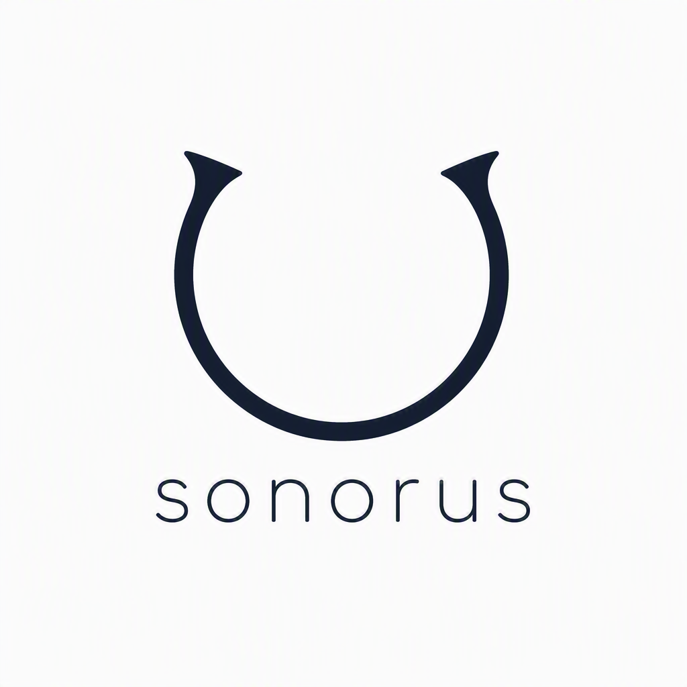
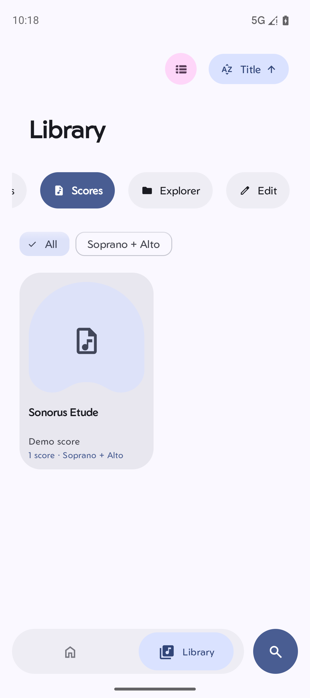
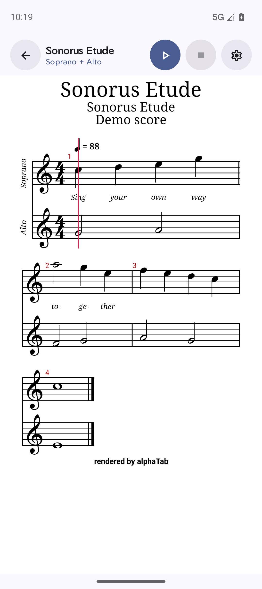
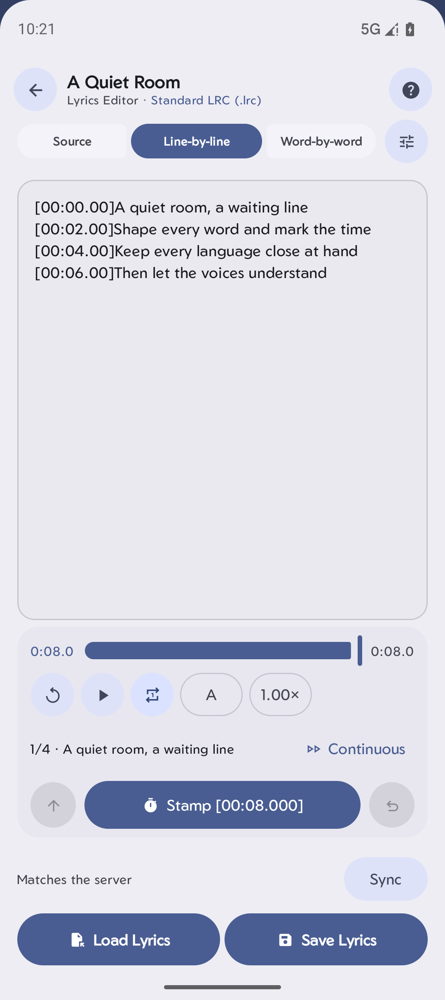

<div align="center">
  

  <h3>Music, lyrics, scores, and your private library — together.</h3>

  <p>
    A local-first Android music player with an optional private Catalog,<br />
    MusicXML score reading, synchronized lyrics editing, and rehearsal tools.
  </p>

  <p>
    <a href="https://github.com/Cluno1/Sonorus/releases/latest"><strong>Download Stable</strong></a>
    ·
    <a href="#screenshots">Screenshots</a>
    ·
    <a href="docs/RELEASING.md">Release integrity</a>
    ·
    <a href="https://discord.gg/KaGCYshewX">Discord</a>
  </p>

  <p>
    
    
    
    
  </p>
</div>

## Why Sonorus

Sonorus treats listening, reading, and rehearsing as parts of the same experience. Use it as a polished offline player, or connect it to a private Catalog when you want a controlled library shared across your own devices.

| | Feature | What it gives you |
| --- | --- | --- |
| 🎧 | **Local music** | Fast on-device browsing, playlists, favorites, search, queue controls, equalizer options, and backup/restore. |
| 🔐 | **Private Catalog** | Optional self-hosted music access with per-device enrollment, authenticated downloads, and multiple registered devices per user. |
| 🎼 | **Music scores** | Browse and render MusicXML scores, select vocal or instrumental parts, follow playback, and work with tempo and metronome controls. |
| ✍️ | **Lyrics workshop** | Edit source text, line timing, or word timing; stamp lyrics against the track; import, save, and synchronize supported lyrics with the Catalog. |
| 🎙️ | **Chorus Lab** | Rehearse against a chosen score revision, record and trim takes, preview submissions, and manage collaborative mixes through invitations. |
| 📱 | **Made for Android** | Material 3 UI with layouts for phones and larger screens, immersive lyrics, Media3 playback, and Android 8.0+ support. |

The private Catalog and Chorus Lab are optional. Local playback does not require a Sonorus server account.

## Screenshots

<table>
  <tr>
    <td align="center"></td>
    <td align="center"></td>
    <td align="center"></td>
  </tr>
  <tr>
    <td align="center"><strong>Score library</strong><br />Organize music by ensemble or part.</td>
    <td align="center"><strong>MusicXML viewer</strong><br />Read the score and follow its playback position.</td>
    <td align="center"><strong>Lyrics editor</strong><br />Edit and stamp line- or word-level timing.</td>
  </tr>
</table>

Screenshots are captured from a headless, silent emulator using a local demonstration Catalog. They contain no production account or server data.

## Download

Signed Stable APKs and their SHA-256 files are published on the [GitHub Releases page](https://github.com/Cluno1/Sonorus/releases/latest).

| Your device | Recommended asset |
| --- | --- |
| Most current Android phones and tablets | `arm64-v8a` |
| Older 32-bit ARM devices | `armeabi-v7a` |
| x86 / x86_64 devices and emulators | Matching x86 build |
| Not sure | Universal APK without an ABI suffix |

Android 8.0 or newer is required. Stable uses application ID `io.github.cluno1.sonorus`; Debug uses `io.github.cluno1.sonorus.debug`, so both can be installed together. Their app data and private-Catalog device registrations are intentionally separate.

Every Stable workflow verifies the package, version, supported ABI, minimum SDK, permanent signing certificate, and checksum before publishing. It then updates the authenticated private channel and creates a GitHub Release with five signed APKs and five matching `.sha256` files.

## Build from source

Requirements: JDK 17 and the Android SDK.

```bash
git clone https://github.com/Cluno1/Sonorus.git
cd Sonorus
./gradlew testGithubDebugUnitTest assembleGithubDebug
```

The official public release target is `githubRelease`. A local release dry-run uses a development certificate unless you provide the protected signing configuration, so it must not be distributed as an official update.

```bash
scripts/release_dry_run.sh 1.0.0
```

See [the release procedure](docs/RELEASING.md), [build variants](docs/BUILD_VARIANTS.md), and [self-hosted update design](docs/SELF_HOSTED_UPDATES.md) for details. No keystore, password, Catalog credential, or cloud-storage credential is stored in this repository.

## Privacy and security

Your device library stays on your device. Network access is used only for features you choose, such as a configured private Catalog, online metadata or lyrics providers, and first-party update checks. Catalog authentication and update downloads fail closed when signatures or device proofs are invalid.

Please report ordinary bugs through [GitHub Issues](https://github.com/Cluno1/Sonorus/issues). Do not post credentials, registration material, signing keys, or vulnerability details in a public issue; follow [SECURITY.md](docs/SECURITY.md) instead.

## Community and private services

- Join the community and share feedback on [Discord](https://discord.gg/KaGCYshewX).
- Email [clunojames@gmal.com](mailto:clunojames@gmal.com) for direct contact.
- Bugs, feature requests, and usability feedback are welcome through [GitHub Issues](https://github.com/Cluno1/Sonorus/issues).
- Private deployments and custom backend services are available; contact us through Discord or email to discuss requirements.

## Upstream and license

Sonorus is an independent, unofficial derivative of [Rhythm](https://github.com/cromaguy/Rhythm), originally created by Anjishnu Nandi and Team ChromaHub. Sonorus is not affiliated with or endorsed by the Rhythm authors or Team ChromaHub. Original copyright and SPDX notices remain in source files and Git history.

The Android client is licensed under [GNU GPL v3 or later](LICENSE). alphaTab is licensed under MPL-2.0; other bundled libraries and assets retain their own licenses. Music, artwork, lyrics, scores, fonts, and SoundFont content are not automatically covered by the client GPL.
